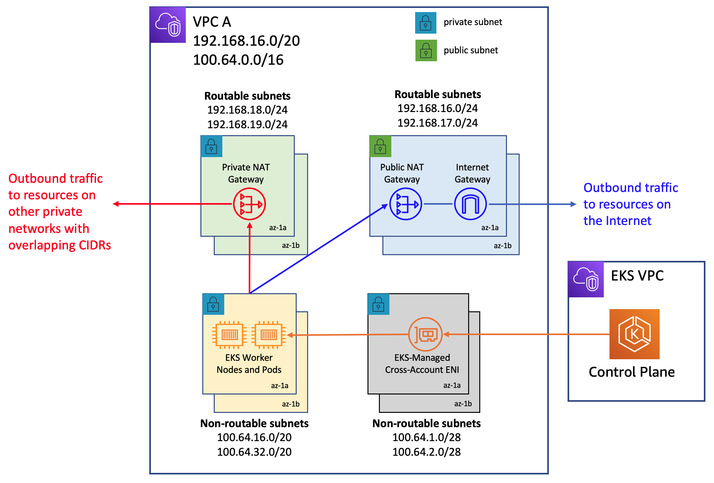
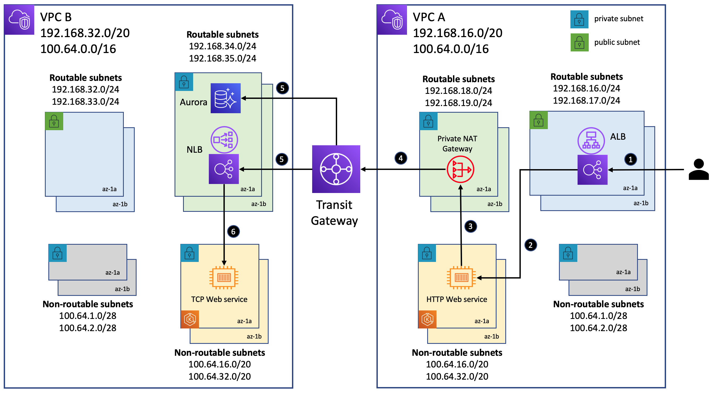

## Addressing IPv4 address Exhaustion in Amazon EKS Clusters using private NAT gateways

This directory contains software artifacts for implementing the networking architecture discussed in this blog in conjunction with an Amazon EKS cluster. It demonstrates a use case where workloads deployed in an EKS cluster provisioned in a VPC are made to communicate, using a private NAT gateway, with workloads deployed to another EKS cluster in a different VPC with overlapping CIDR ranges. 

## Network architecrue

## Solution architecrue

## Deploy

### Setting up the network architecture
1. Execute the script **vpc-a.sh** to setup a VPC named **EKS-VPC-A** with the routable CIDR 192.168.16.0/20 and non-routable CIDR 100.64.0.0/16
2. Execute the script **vpc-b.sh** to setup a VPC named **EKS-VPC-B** with the routable CIDR 192.168.32.0/20 and non-routable CIDR 100.64.0.0/16
3. Execute the script **tgw.sh** to setup a transit gateway and transit gateway attachments to route traffic between the two VPCs. This script update the route tables associated with the transit gateway as well as the routable subnets in the two VPCs.

### Setting up the EKS clusters 
7. Execute the script **cluster-a.sh** to launch an EKS cluster into **EKS-VPC-A** and provision a managed node group.
8. Execute the script **cluster-b.sh** to launch an EKS cluster into **EKS-VPC-B** and provision a managed node group.

10. Execute the script **postgres/setup.sh** to setup an Aurora PostgreSQL database instance in **EKS-VPC-B**
11. Follow the instructions in **postgres/initialize.sh** to initialize this database instance with tables and import sample data into it. The commands in this step should be executed from an EC2 instance that resides in **EKS-VPC-B**

